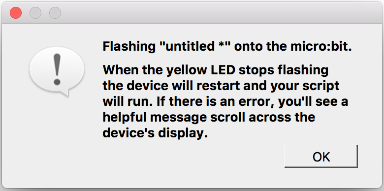

# Micro:bit & Mu editor

## What will you learn during this chapter ?

* What BBC Micro:bit is
* In which language we can talk with BBC Micro:bit
* How to talk with your Micro:Bit (Mu editor)

## BBC Micro:bit
What is a BBC Micro:bit ?

It should be in your hands already.....is a very tiny device, a small computer.

It has 2 main buttons (A and B), a display formed by 25 red leds (very small lights), a radio module and some sensors, an accelorometer and a compass.

We can use the buttons and the sensors as inputs (input means we give some information to the microbit) and the display to show something like images and text (output).

You can program your Micro:bit connecting it to your computer, it has a micro-usb port, if you plug it you will see leds blinking.
It also has a small connector where you can plug a battery-box, in this way you can give energy to your Micro:bit without a computer.

## Talking with your BBC Micro:bit
So to talk with your BBC Micro:bit you need to talk a language that it can understand: Python.

But where can we write our code ? We can use a text editor for this, **Mu**.
Mu is an editor specifically made to program the BBC Micro:bit.

Let's start Mu.

You should have Mu editor already installed on your computer, if not please check this [page](/README.md#install-mu-editor "Install Mu editor").

## Mu editor

First of all you should launch your Mu editor and then see something similar to these screen

1. The red area is where you should write your code
2. In the blue area you can find 4 very important buttons.

Here you can see the buttons bigger.

The 4 buttons are:

1. New: to open new tabs inside Mu editor
2. Load: to load a file from your computer
3. Save: to save your code in your computer
4. Flash: this is the command to send the code to your Micro:bit

There is an important note about the files that you save and load, they are just text.
But how do we recognize that is _python_ file ?
By the name.

Let's save our first file on your computer.

1. Press the save button
2. Change the location to save the file in your desktop
2. Type the name for your file (try your name!)
3. Press save!

Now let's look at your file... it's called yourname.py

What does __.py__ mean ?

Well Python code is just text....so we can recognize a python (text) code by __.py__.
But with Mu we don't have to worry about adding __.py__ because is doing this for us.

## Our very first first program

So Mu is still open, now you can connect the Micro:bit to your computer and press __flash__.

If you see this box don't worry, just press `OK`

You should see the yellow led light blinking....is working!

## What is a BBC Micro:bit ?

* A tv series from BBC
* A programming language
* A microcomputer you can program
* An editor

## Try to open your Mu editor and save a file and load that file

* What it means 'programming'
* What BBC Micro:bit is
* In which language we can talk with BBC Micro:bit
* How to talk with your Micro:Bit (Mu Editor)

## That's all

Ready for the next chapter ?
