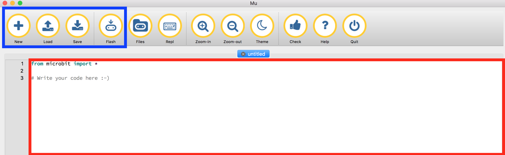

# Micro:bit & Edytor Mu

## Czego nauczysz się w tym rozdziale?

* Czym jest BBC:Microbit
* W jakim języku możemy rozmawiać z Micro:bitem
* Jak rozmawiać z Micro:bitem (Edytor Mu)

## BBC Micro:bit
Czym jest BBC Micro:bit ?

Powininen być właśnie przed Tobą. To bardzo cienkie urządzenie, mały komputer.

Ma 2 główne przyciski (A i B), wyświetlacz 5 x 5 składający się z czerwonych diod, kilka sensorów, akcelerometr i kompas.

Możemy używać przycisków i sensorów jako wejść (wejście oznacza miejsce, przez które dajemy informacje microbitowi) a wyświetlacza po to, by nam coś pokazywał, np. obrazki albo tekst (to jest nasz output, czyli wyjście).

Możesz programować swojego Micro:bita podłączając go do komputera, ma port micro-usb. Jak go podłączysz zobaczysz migającą diodę. Microbit ma również małe złącze, do którego możesz podłączyć baterie, dostarczając mu w ten sposób energię bez użycia komputera. 

## Rozmawianie z Micro:bitem
Żeby rozmawiać ze swoim Micro:bitem potrzebujesz mówić w języku, który on rozumie, czyli w Pythonie.

Ale gdzie możemy pisać nasz kod? Można do tego użyć edytora tekstowego ,,Mu". Mu jest specjalnym edytorem stworzonym do programowania Micro:bitów.

Zacznijmy korzystać z edytora Mu.

Powinieneś mieć już zainstalwany edytor Mu na swoim komputerze. Jeśli jeszcze go nie masz, odwiedź tą [stronę](/README.md#install-mu-editor "Install Mu editor").

## Edytor Mu

Najpierw powinieneś otworzyć Mu editor na swoim komputerze. Powinieneś zobaczyć coś podobnego:

1. Czerwone pole to miejsce, w którym piszesz swój koda
2. Niebieskie pole to miejsce, w którym znajdują się 4 ważne przyciski.

Tutaj możesz zobaczyć te 4 przyciski w powiększeniu.

Te 4 przyciski to:

1. New: otwiera nową kartę w edytorze Mu
2. Load: ładuje plik z Twojego komputera
3. Save: zapisuje Twój kod na komputerze
4. Flash: ta komenda wysyła kod do Twojego Micro:bita

Pliki, które zapisujemy i ładujemy, to zwykły tekst, czyli pliki tekstowe. Ale jak rozpoznajemy, że są to pliki Pythona?
Po nazwie. (A dokładniej, po rozszerzeniu tej nazwy po kropce).

Zapisz swój pierwszy plik na komputerze.

1. Kliknij przycisk ,,Save"
2. Zmień lokalizację zapisania swojego pliku tak, by zapisać go na Pulpicie
2. Wpisz nazwę swojego pliku (np. Twoje imię)
3. Naciśnij ,,save"!

A teraz spójrz na swój plik: nazywa się twojeImię.py

Co oznacza .py?

Kod Pythona to zwykły tekst, tylko posiadający rozszerzenie .py, i tak też możemy rozpoznać, że jest to plik Pythona, czyli taki, którego Python zrozumie.
Edytor Mu automatycznie zapisuje pliki w formacie .py, więc nie musimy się sami o to martwić.

## Nasz pierwszy program

Mając już otwarty edytor Mu, możesz teraz podłączyć Micro:bita do swojego komputera i nacisnąć przycisk ,,Flash".

Powinieneś widzieć migające żółte światełko. To oznacza, że wszystko działa, i komputer widzi Micro:bita.

A teraz mała powtórka.

## Czym jest BBC Micro:bit?

* Serialem telewizyjnym BBC?
* Językiem programowania?
* Mikrokomputerem, który możesz programować?
* Edytorem?

## Spróbuj otworzyć Mu editor, zachować plik i następnie go załadować (otworzyć)

* Co oznacza słowo ,,programowanie"?
* Czym jest BBC Micro:bita?
* W jakim języku możemy rozmawiać z Micro:bitem?
* Jak rozmawiać z Micro:bitem (Mu Editor)

## Na razie to wszystko

Gotowy na następny rozdział?
